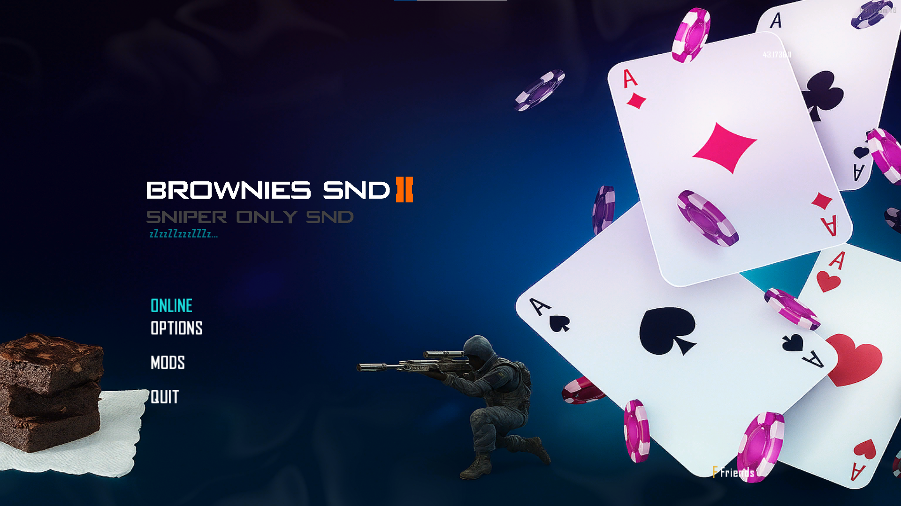

*Hop on brownies :)*

# Brownies Pack – Cyan / Light Blue Theme for Plutonium T6MP

This is a **cyan / light blue** (idk) **visual theme** for **Plutonium T6 Multiplayer**. It changes menu images and UI elements to give a fresh, light-blue look with other little fun stuff added :)

**Installation:**  
No .iwd mod required — just **drag and drop** or use the included installer:

1. **Automatic:**  
   - Run `install.bat` and it will copy all files to the correct Plutonium directories.  

2. **Manual:**  
   - Copy the contents of the `images` folder to:  
     ```
     %LOCALAPPDATA%\Plutonium\storage\t6\images
     ```  
   - Copy the contents of the `raw` folder to (not suggested):  
     ```
     %LOCALAPPDATA%\Plutonium\storage\t6\raw
     ```  
   - Keep the folder structure intact for proper functionality.

---

works with online (tested on brownies rrahhh 🦅) 

----

# Come Play on Brownies SND 🍰
### Why Brownies? 🤔
- **Stability:** Brownies delivers a consistent, lag-free experience, making it the perfect choice for players who demand uninterrupted action
- **Community:** The players at Brownies are known for being helpful, competitive, and fun—something Orion can only dream of
- **Events & Features:** Brownies is constantly running unique events and offers more server-side customization options than Orion, ensuring every game feels fresh

---

#### [Brownies Discord](https://discord.gg/DtktFBNf5T) | [Brownies IW4M](http://193.23.160.188:1624/) | Made With ❤️ By Budiworld
